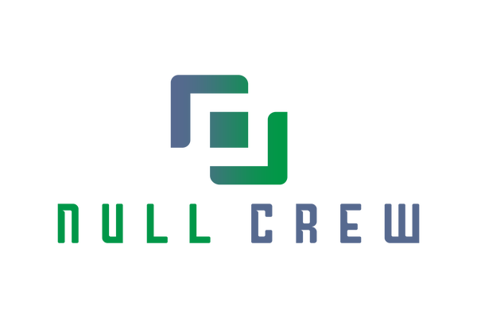

# Sudoku Solver
### Hi, This is Team NullCrew.

### Welcome to Sudoku Solver!
#### Its all about detecting and directly solving sudoku puzzles in VR using [OpenCV](https://opencv.org/) and [TensorFlow](https://www.tensorflow.org/).


## What is it doing ?
For a single image process, the algorithm works as following :
### Grids  Extraction
Firstly, the algorithm has to find where the grids are. 
The pipeline is:
1. Preprocess image to enhance high frequencies.
2. Find lines using Hough Space.
3. Analyse lines to know which can correspond to a grid.

<p align="center">

</p>

### Digits Identification & Grids Solving
Once grids are extracted, for each grid we do:

* Detect shape which can be digits.
* Use CNN do identify digits.
* Create a numeric grid in a table and solve it.


### Grids Reconstruction
* Create a virtual image to fill the initial image.
* Add the 2 images together to create the final result.

## How to use?

The best way to use the program is to firstly clone the repo.
```bash
git clone https://github.com/ibhanu/sudoku-solver.git
```
Then, open a terminal & go in the repository  
```bash
cd /path/to/the/folder/sudoku-solver/
```

The required libraries are specified in requirements.txt. Run 
```bash
pip3 install -r requirements.txt
```

Take a picture of your process target (Sudoku Puzzle) and use the command
```bash
python3 sudoku_solver_main.py -i path/to/your/file
```
Add `-s 1` to save the output result. It will be save in the directory `images_save`.
In both cases, the result will be displayed in the process.

If you have your own Keras model to identify digits.
For that use the argument -mp `-mp path/to/your/model` 

### Where do I find weights for the CNN?
The model is already trained with a dataset of 10k numeric digits
with data augmentation. It gives a precision of 99.5%

## Authors
- Abhay R Muni
- Ashritha C
- Bhanu Pratap
